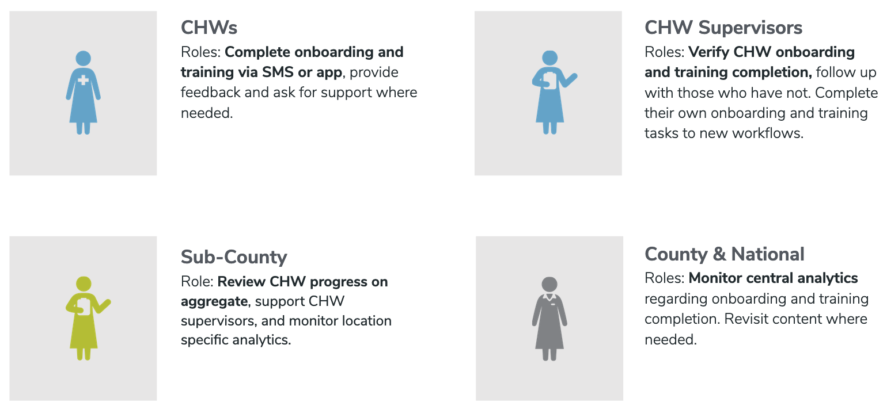

The CHT’s Remote Onboarding and Training functionality enables Supervisors and Administrators to train CHWs on care workflows and related app use without being physically present. It is designed for:

* Safety: maintaining distance due to infectious disease
* Speed: faster deployment when timing is a critical
* Scalability: onboarding large numbers of users at the same time
* Measurability: evaluation to provide added support where needed
* Adaptability: integration with existing program and workflow structures

## Problem Being Addressed

Providing consistent training for CHWs is critically important in the context of evolving health programs and use of digital support tools. In-person training is often not feasible (due to distance, infectious disease outbreaks, or similar), but is still required to build and maintain effective care programs. Relying on CHWs to learn to use these new digital tools and adhere to care workflows on their own is a major challenge to health program success.

## Solution Overview

The CHT’s onboarding and training capabilities offer a remote way to provide education to CHWs and Supervisors about digital tools functionality and care workflows. It can be deployed in both SMS and App based modules. Through asynchronous communication, program administrators are able to:

* Create customized training modules that match program requirements
* Capture assessments of CHW knowledge levels of training material
* Assess user training participation abandonment
* Identify CHWs who need additional Supervisor support

## User Roles Example

 

## Reporting Hierarchy Example

## Workflow Examples

These SMS and App based workflow examples illustrate how the CHT enables remote training, tasking and communication at scale. Training can be done using simple guides, audio/videos suitable for low bandwidth, or interactive experiences on personal devices. Training programs can be easily configured to suit specific health program needs.

### Remote Training by SMS

### Remote Training by App

More background information can be found in this [summary deck](https://docs.google.com/presentation/d/13bFoyU2vhwPiOUiVWzUJ2urtAyR6_XKTxp0XASCLVko/edit#slide=id.g849d570821_4_124).
