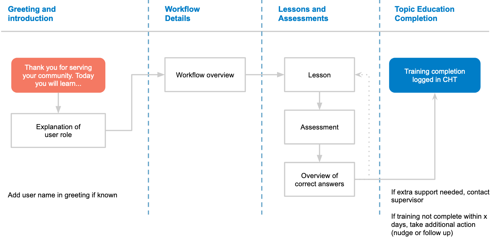

Three learning modules were created, both via the CHT and via SMS and messaging-based applications, to rapidly and remotely train CHWs on COVID-19. The combination of CHT and SMS enables Supervisors to train CHWs on workflows without being physically present, and cater to those without reliable data connection through SMS. Each learning module contains a quiz at the end to reinforce learning, which can be tracked by Supervisors. The application covers the below three modules:

* Health safety protocols for preventing the spread of COVID-19
* Preventing the dissemination of misinformation about COVID-19
* Recognizing COVID-19 and caring for patients with suspected infection

## Problem Being Addressed

Now, more than ever, it is important for health care workers to stay safe and serve their communities by understanding effective health protocols for preventing the spread of COVID-19. This training would traditionally be done in person, however health systems must adapt and still deliver this content in a timely and effective manner. A form-based application was designed using the CHT to deliver three learning modules, utilizing tasks to order the module and enable the CHW to progress through. 
Given COVID-19 is impacting even the hardest-to-reach communities, the modules can also be delivered via SMS to support CHWs who either don't have access to a smartphone or the CHT app, or don't have access to reliable data connection. 

## Solution Overview

The CHT application, combined with SMS workflow, offers a flexible way to deliver timely COVID-19 information to CHWs. The three learning modules:

* Build on verifiable health safety guidance from the CDC and WHO
* Were carefully crafted by [Stanford's Digital Medic Team](https://digitalmedic.stanford.edu/) team and vetted by a team of health experts at Stanford
* Can be deployed using the CHT app or SMS workflows 
* Capture assessment and understanding of knowledge through quizzes

### User Roles Example

 

### Reporting Hierarchy Example

## Workflow Examples

### Remote Training by App

This demo illustrates how a CHT workflow can be easily adapted to integrate a sequence of learning modules through the usage of tasks. These modules can be delivered sequentially and learning can be tracked across CHWs. 

<iframe width="560" height="315" src="https://www.youtube.com/embed/pFEFIY_SA7M" frameborder="0" allow="accelerometer; autoplay; encrypted-media; gyroscope; picture-in-picture" allowfullscreen></iframe>

### Remote Training by SMS

The workflow involves interacting with the CHW through SMS and utilizing text-based feedback from the CHW, along with branching logic, to promote engagement and absorption of content. CHWs can be prompted with a question and reply via a message to assess understanding of content.

## Documentation and More Information

For more detailed information, please reference documentation for both the [CHT application](https://docs.google.com/document/d/1Vd6x_WwS-S_sekRQnvW1UAS_rWaTnaawITfeXgX6Sdg/edit) and the [SMS and Messaging workflow](https://docs.google.com/document/d/1fPqZhl5gYoW_UJx6E3EWngWcICOH8mfmslo4r5JqmE0/edit?usp=sharing), which both cover more detailed information about the content, key considerations for adapting the content, and the technical implementation. 
